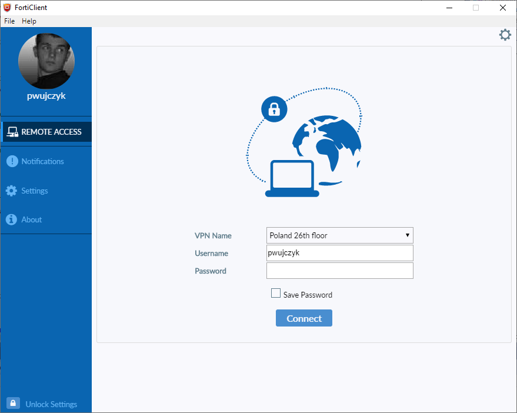

<!--Category:PowerShell--> 
 <p align="right">
    <a href="https://www.powershellgallery.com/packages/ProductivityTools.PSDisplayPosition/"></a>
    <a href="http://www.productivitytools.tech/display-position/"><a> 
    <a href="https://github.com/pwujczyk/ProductivityTools.PSSaveLoginAndPasswordForFortiClient"></a>
</p>
<p align="center">
    <a href="http://http://productivitytools.tech/">
        
    </a>
</p>

# Display position

Changes the registry to allow user to save password to all FortiClient connections

<!--more-->
<!--og-image-->
 

FortiClient allows to save Username and password to all defined connections. Configuration is stored in ```HKCU:\Software\Fortinet\FortiClient\Sslvpn\Tunnels\```

Module adds keys 
- save_username
- SavePass
- show_remember_password

```PowerShell
Save-LoginAndPasswordForFortiClient -Verbose
```

 

